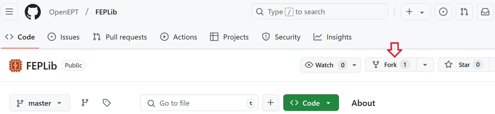
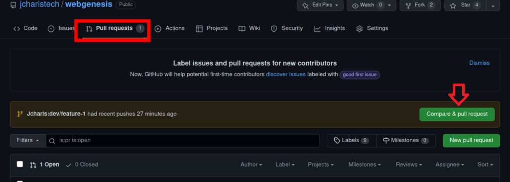

[](https://openept.net)

Open-source battery charger platform developed as part of the OpenEPT ecosystem. The Charger board is intended to extend the OpenEPT platform with battery charging capabilities and to provide the hardware foundation for integrated battery charging, characterization, and energy-profiling experiments.

Official [YouTube](https://www.youtube.com/playlist?list=PLTG-EoxvlLos_3Sex3R0yfDCwpDYyRSOo) channel

[](https://ko-fi.com/M4M51XTW8X)

---

# Content

- [Features](#features)
- [Charger Board](#charger-board)
- [Building and Running the Charger Firmware](#building-and-running-the-charger-firmware)
- [Contributor guide](#contributor-guide)
- [Documentation](#documentation)
- [Acknowledgments](#acknowledgments)

---

# Features

The OpenEPT Charger is being developed as an extension of the OpenEPT hardware platform, providing dedicated battery-charging functionality and integration with the Energy Profiler Probe.

The Charger board is designed to operate together with the Energy Profiler Probe through the dedicated charger interface available on the latest EPP hardware revision.

> **Note:** The Charger hardware and firmware are currently under development. Additional features, hardware documentation, firmware instructions, and board specifications will be added as development progresses.

---

# Charger Board

The OpenEPT Charger board provides the hardware platform for adding controlled battery charging to the OpenEPT ecosystem. Together with the Energy Profiler Probe, it is intended to enable experiments that combine battery charging, controlled discharge, battery characterization, and energy profiling within the same platform.

The first revision of the Charger board is currently under development.


*OpenEPT Charger board.*

---

# Building and Running the Charger Firmware

Firmware build and programming instructions will be added once the initial Charger firmware is available.

---

# Contributor guide

## Step 1:  Fork the Repository

To start contributing, fork the main repository to your own GitHub account:

1. Navigate to the repository you want to contribute to.
2. Click the **Fork** button in the upper-right corner. *(This is an example for `OpenEPT/FEPLib` repo.)*

3. This will create a copy of the repository under your GitHub account.

## Step 2: Clone the Forked Repository

Once the repository is forked, clone it to your local machine:

```bash
# Replace <your-username> with your GitHub username
git clone https://github.com/<your-username>/<repository-name>.git
cd <repository-name>
```

## Step 3: Create a New Branch

Before making changes, create a new branch based on the type of contribution:
- For new features, name the branch `feature/<name>`.
- For bug fixes, name the branch `bug/<name>`.

To create a branch:

```bash
# Replace <branch-name> with your branch name
# Example for a feature: feature/apard32690_lib
# Example for a bug fix: bug/fix_esp12e_lib
git checkout -b <branch-name>
```
## Step 4: Make your changes

Make the necessary changes to your branch. Test thoroughly to ensure your contribution does not introduce new issues.

Before any changes, please read developer [Documentation](#documentation)

## Step 5: Commit your changes

Once your changes are ready, stage and commit them:

```bash
git add .
# Write a descriptive commit message
git commit -m "Description of the changes made"
```
## Step 6: Push Your Changes to Your Fork

Push the changes to your forked repository:

```bash
# Push the branch to your fork
git push origin <branch-name>
```
## Step 7: Create a Pull Request
1. Navigate to your forked repository on GitHub.
2. Switch to the branch you just pushed.
3. Click the **Compare & pull request** button.

4. Ensure the base repository is set to the main/master repository and the base branch is `main
5. Provide a descriptive title and detailed description for your pull request.
6. Add appropriate reviewers
7. Submit the pull request.

## Step 8: Collaborate on the Review Process

Once the pull request is submitted:
1. Wait for project maintainers to review your changes.
2. Address any feedback provided by making additional commits to your branch.
3. Once approved, the maintainers will merge your changes.

## Step 9: Sync with the Main Repository

After your changes are merged, keep your fork updated with the main repository to avoid conflicts:
```bash
git remote add upstream https://github.com/<original-owner>/<repository-name>.git
git fetch upstream
git checkout main
git merge upstream/main
```
---

# Documentation

For detailed developer instructions and additional OpenEPT materials, please see the [Materials](https://www.openept.net/pages/materials) section on the official project website.

---

# Acknowledgments

[](https://nlnet.nl/)
